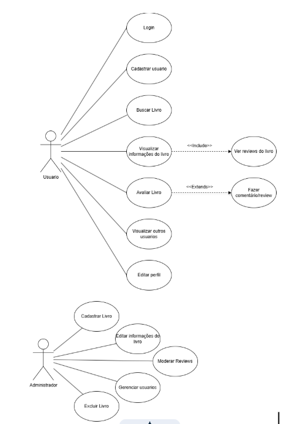

# LivroLog


LivroLog é uma plataforma web colaborativa de avaliação de livros. O sistema permite que leitores registrem críticas, atribuam notas e descubram novos títulos através das opiniões da comunidade. Além das avaliações, a plataforma conta com perfis de usuário, busca por obras e autores e uma rede social baseada em afinidades literárias.

Desenvolvido como projeto final da disciplina de Desenvolvimento de Aplicações na Web — UDESC Joinville.

---

## Diagramas



---

## Stack

| Camada | Tecnologia |
|---|---|
| Frontend | Vue.js |
| Backend | Go Lang |
| Banco de dados | MySQL / PostgreSQL |
| Estilização | Tailwind CSS / DaisyUI |
| Versionamento | Git + GitHub |
| Editor | Visual Studio Code |

---

## Estrutura do projeto

```
LivroLog/
├── frontend/    # Interface Vue.js
├── backend/     # API Go Lang
└── README.md
```

---

## Funcionalidades

- Cadastro e login de usuários
- Perfil pessoal com histórico de avaliações
- Cadastro, edição e exclusão de livros (restrito ao administrador)
- Busca de livros por título, autor e gênero
- Busca de usuários por nome
- Registro de avaliações com nota (1 a 5) e comentário
- Edição e exclusão de avaliações próprias
- Média de notas calculada automaticamente por livro
- Visualização de perfis de outros usuários e seus livros avaliados
- Exclusão de conta

---

## Como rodar localmente

### Pré-requisitos

- Node.js 18+
- Go 1.21+
- MySQL ou PostgreSQL
- Git

### 1. Clone o repositório

```bash
git clone https://github.com/seu-usuario/livrolog.git
cd livrolog
```

### 2. Configure o banco de dados

Crie um banco de dados e configure as variáveis de ambiente no backend:

```env
DB_HOST=localhost
DB_PORT=3306
DB_USER=seu-usuario
DB_PASSWORD=sua-senha
DB_NAME=livrolog
```

### 3. Inicie o backend

```bash
cd backend
go run main.go
```

### 4. Inicie o frontend

```bash
cd frontend
npm install
npm run dev
```

O app estará disponível em `http://localhost:5173`